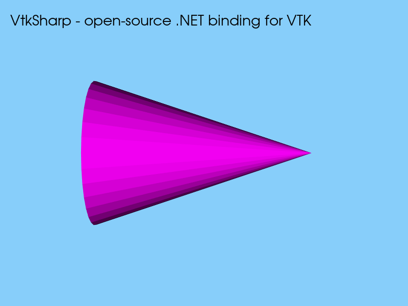

# VtkSharp

非官方 [VTK](https://vtk.org/) .NET 绑定库，采用 C ABI shim + C# P/Invoke 路线，面向 CAD/CAE 可视化场景，无需 C++/CLI。本项目与 Kitware 无隶属关系，也未经其背书。

[](LICENSE)

## 特性

- 基于白名单的绑定生成器，按需导出 VTK API
- 支持 `netstandard2.0` 和 `net8.0` 多目标框架
- 示例浏览器，包含几何对象、建模等分类示例
- 提供事件回调、数组和字符串等手写互操作辅助接口

当前 API 按白名单逐步补充，并非完整 VTK 封装；不承诺与其他 VTK .NET 绑定源码兼容。
公开 API 仍可能随开发调整，升级时请同时更新配套的托管程序集和 native DLL。

## 支持范围与环境

| 组件 | 当前目标 / 要求 |
| --- | --- |
| 托管绑定库 | `netstandard2.0`、`net8.0` |
| Native 构建与打包 | Windows x64，VTK 9.7.0 静态库 |
| 示例浏览器 | WPF，`net8.0-windows`，.NET 8 Desktop Runtime |
| 绑定生成器与生成器测试 | .NET 10 SDK，Windows x64 |
| 从源码构建 | Git、PowerShell 7、.NET 8 SDK（完整开发另需 .NET 10 SDK） |
| VTK 默认构建工具链 | Visual Studio 2026 的 C++ 桌面开发工作负载、Windows SDK、CMake 4.2 或更高版本 |

`netstandard2.0` 仅表示托管 API 的目标框架，不代表 native 层已经支持 Linux、macOS 或 ARM64。
渲染示例需要可用的桌面图形环境。VS 2022 回退仅由 VtkSharp native 构建脚本提供，
不适用于固定使用 VS 2026 的 VTK 构建脚本，详见 [构建说明](docs/build/vtksharp.md)。

## 快速开始（从源码）

以下命令在 PowerShell 中执行。首次克隆项目后，所有仓库内命令均在仓库根目录运行：

```powershell
git clone https://github.com/wudong-lab/VtkSharp.git
Set-Location VtkSharp
```

### 1. 准备 VTK

将下面的工作目录替换为自己的路径，在尚不存在的源码目录中克隆 VTK，并完成 Release 安装：

```powershell
$vtkWorkspace = "D:\Dependencies\VTK"
$vtkSource = Join-Path $vtkWorkspace "source"
$vtkBuild = Join-Path $vtkWorkspace "build"
git clone --branch v9.7.0 --depth 1 https://gitlab.kitware.com/vtk/vtk.git $vtkSource

.\tools\build-vtk-for-vtksharp.ps1 -Configuration Release `
    -SourceDirectory $vtkSource -BuildDirectory $vtkBuild
```

默认安装到 `$vtkBuild/install`。已有同版本、同配置且包含所需模块的 VTK 安装时，可跳过此步。
源码版本、Debug/Both、仅配置和模块开关见 [VTK 构建说明](docs/build/vtk.md)。

### 2. 设置 VTK 环境变量

VTK 安装完成后，在 PowerShell 中设置以下环境变量，并将示例路径替换为自己的安装路径：

```powershell
# VTK installation root, used by the binding generator
$env:VTK_ROOT = "D:\Dependencies\VTK\build\install"

# VTK CMake package directory, used by native builds
$env:VTK_DIR = Join-Path $env:VTK_ROOT "lib\cmake\vtk-9.7"
```

两个目录的含义：

- `VTK_ROOT` 是 **VTK 安装根目录**，即安装步骤将头文件、编译好的库和配套配置文件汇集到的目录。
  它不是下载的源码目录，也不是存放 Visual Studio 工程和中间文件的构建目录。VtkSharp 生成器
  从这里查找 C++ 头文件（用于解析 API 声明）和 hierarchy 文件（用于查询类型、继承关系与模块归属）。
  此环境变量优先于生成器配置文件中的 `vtk.rootDirectory`。
- `VTK_DIR` 是 **VTK 的 CMake package 目录**，其中必须包含 `VTKConfig.cmake` 或
  `vtk-config.cmake`。构建 `VtkSharp.Native` 时，CMake 通过该配置获取 VTK 模块、头文件路径、
  库文件位置及依赖信息，以便编译和链接。它不是 `.lib` 文件所在目录，也不是运行时 DLL 搜索目录；
  应填写配置文件所在的文件夹，而不是配置文件本身的完整路径。

按本项目脚本安装 VTK 9.7 后，关键目录关系如下（省略其他文件）：

```text
install/                               ← VTK_ROOT
├── include/
│   └── vtk-9.7/
│       └── vtkObject.h                 # C++ 头文件
└── lib/
    ├── *.lib                           # 编译好的 VTK 及依赖库
    ├── cmake/
    │   └── vtk-9.7/                    ← VTK_DIR
    │       └── vtk-config.cmake        # CMake package 入口
    └── vtk-9.7/
        └── hierarchy/
            └── VTK/
                └── vtkCommonCore-hierarchy.txt
```

因此，这里的 `VTK_DIR` 是 `VTK_ROOT` 下的 `lib/cmake/vtk-9.7` 子目录。两者必须对应同一份
VTK 安装，不能互换；VTK 构建脚本完成安装时也会输出 `VTK_DIR`。仅构建但未执行安装时，
上述安装目录可能尚未生成。

上述设置只对当前 PowerShell 会话及其后启动的子进程生效。需要持久保存为 Windows
用户环境变量时，在完成上述设置后执行：

```powershell
[Environment]::SetEnvironmentVariable("VTK_ROOT", $env:VTK_ROOT, "User")
[Environment]::SetEnvironmentVariable("VTK_DIR", $env:VTK_DIR, "User")
```

已经运行的其他终端、IDE 或 Codex 不会自动更新其进程环境，需重新启动对应应用。
后续更换 VTK 安装时，应同时更新这两个变量。设置环境变量不会下载、构建或安装 VTK，
也不会改变 `build-vtk-for-vtksharp.ps1` 的源码和构建目录；这些目录使用脚本参数指定。

### 3. 构建并运行示例

构建脚本默认读取 `VTK_DIR`，也可用 `-VtkDir <path>` 覆盖本次构建的路径：

```powershell
.\tools\build-all.ps1 -Configuration Release
dotnet run --project src/examples/ExampleBrowser/ExampleBrowser.csproj --configuration Release
```

在浏览器中选择 `GeometricObjects / Cone` 并运行，应看到品红色三维圆锥和 VtkSharp 说明文字。
其他示例包括网格、图像、交互、背景渐变，以及 WPF 承载和事件回调，见 [示例说明](src/examples/README.md)。

`build-all.ps1` 只构建绑定库和 native 项目，不构建生成器、测试或示例；它将产物收集到
`artifacts/bin/<TFM>`，每次运行会重新创建 `artifacts/bin`。示例命令使用相同的 Release 配置，
以便项目自动复制对应的 `VtkSharp.Native.dll`。仅运行 `dotnet build` 不会编译 native 层。

仓库已包含生成的绑定，普通构建无需先运行生成器。本页采用源码构建流程；本地 NuGet 打包、
部署依赖及 Debug 配置见 [VtkSharp 构建说明](docs/build/vtksharp.md)。

## 最小渲染示例

下面是圆锥渲染的核心代码，完整可运行版本见 [Cone](src/examples/ExampleBrowser/Examples/GeometricObjects/Cone/Cone.cs)：

运行截图（800×600，直接由示例的 VTK 渲染窗口导出）：



```csharp
using VtkSharp;

using var cone = vtkConeSource.New();
cone.SetHeight(3.0);
cone.SetRadius(1.0);
cone.SetResolution(32);

using var mapper = vtkPolyDataMapper.New();
mapper.SetInputConnection(cone.GetOutputPort());

using var actor = vtkActor.New();
actor.SetMapper(mapper);
actor.GetProperty().SetColor(VtkColor3d.Magenta);

using var textActor = vtkTextActor.New();
textActor.SetInput("VtkSharp - open-source .NET binding for VTK");
textActor.GetPositionCoordinate().SetCoordinateSystemToNormalizedViewport();
textActor.SetPosition(0.025, 0.95);
textActor.GetTextProperty().SetVerticalJustificationToTop();
textActor.GetTextProperty().SetFontSize(28);
textActor.GetTextProperty().SetColor(0.0, 0.0, 0.0);

using var renderer = vtkRenderer.New();
renderer.SetBackground(VtkColor3d.LightSkyBlue);
renderer.AddActor(actor);
renderer.AddViewProp(textActor);

using var window = vtkRenderWindow.New();
window.AddRenderer(renderer);
window.SetSize(800, 600);

using var interactor = vtkRenderWindowInteractor.New();
interactor.SetRenderWindow(window);
window.Render();
interactor.Start();
```

`New()` 创建的拥有型 wrapper 应使用 `using` / `Dispose()` 释放；借用指针和回调有不同的
生命周期约束，参见 [对象所有权](docs/native-pointer-ownership.md)。不要混用不同构建产物的 native 指针。

## 开发与贡献

```text
src/bindings/   # C# wrapper、C ABI 导出与绑定测试
src/generator/  # CLI、GUI、生成器核心、白名单与测试
src/examples/   # WPF 示例浏览器
tools/          # 构建、打包与验证脚本
docs/           # 架构与开发文档
```

欢迎通过 [Issues](https://github.com/wudong-lab/VtkSharp/issues) 报告问题或提出缺失 API，
通过 Pull Request 提交改进。报告问题请附上最小复现、VTK/.NET/工具链版本、构建配置及日志；
渲染问题另附 GPU/驱动信息与截图。

- [贡献指南](CONTRIBUTING.md)：修改范围、候选白名单与测试要求。
- [生成器文档](docs/generator.md)：需要 .NET 10 SDK 和 `VTK_ROOT`；日常增量生成，提交前全量检查。
- [项目文档](docs/README.md)：架构、构建、互操作及可选的 AI 辅助工作流。

配置好环境后，完整验证入口为：

```powershell
.\tools\verify-workflow.ps1 -Example GeometricObjects/Cone
```

该命令不替代交互和生命周期的人工验收，详见 [验证说明](docs/workflow/verification.md)。

## 许可

VtkSharp 使用 [BSD-3-Clause](LICENSE)。VTK 的许可声明见 [VTK-LICENSE.txt](src/bindings/VtkSharp/VTK-LICENSE.txt)，
VTK 及其第三方依赖保留各自许可；分发二进制时还应保留所包含依赖的许可声明。
